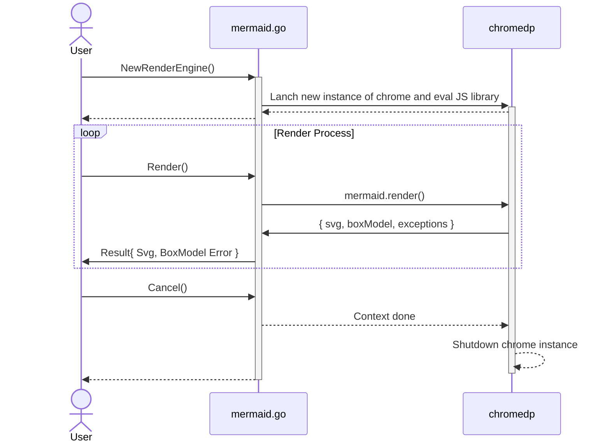

# mermaid.go

[mermaid.go][] is a library for invoking [mermaid.js](https://github.com/mermaid-js/mermaid) and getting rending result.



Installation:

```shell
go get -u github.com/dreampuf/mermaid.go
```

Example: 

An example is available [here](example/main.go).

# How to build

1. Checkout the code base
   `git clone https://github.com/dreampuf/mermaid.go.git`
2. Fetch the latest version of mermaid.js  
    `curl -LO https://unpkg.com/mermaid/dist/mermaid.min.js`
    Or if you want a specific version
    `curl -LO https://unpkg.com/mermaid@10.3.0/dist/mermaid.min.js`
3. Test it  
   `go test ./...`

# License

- [mermaid.go][]: MIT License
- [mermaid.js][]: MIT License
- [chromedp]: MIT License
 
[mermaid.go]: https://github.com/dreampuf/mermaid.go
[mermaid.js]: https://mermaid-js.github.io/mermaid/
[chromedp]: https://github.com/chromedp/chromedp

