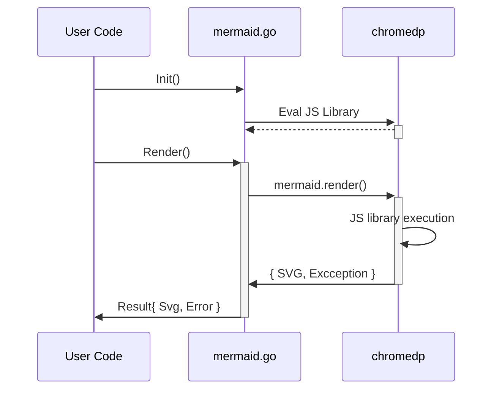

# Mermaid.go

[Mermaid.go][] is a library for invoking [mermaid.js][] and getting rending result.



Example: 

```go
ctx1 := context.Background()
re1 := NewRenderEngine(ctx1)
defer re1.Cancel()
content := `graph TD;
    A-->B;
    A-->C;
    B-->D;
    C-->D;`

svg_content, _ := re1.Render(content)
```

# How to build

1. Checkout the code base
   `git clone https://github.com/dreampuf/mermaid.go.git`
2. Fetch the latest version of mermaid.js  
    `curl -LO https://unpkg.com/mermaid/dist/mermaid.min.js`
3. Test it  
   `go test ./...`

Mermaid.go: https://github.com/dreampuf/mermaid.go
mermaid.js: https://mermaid-js.github.io/mermaid/