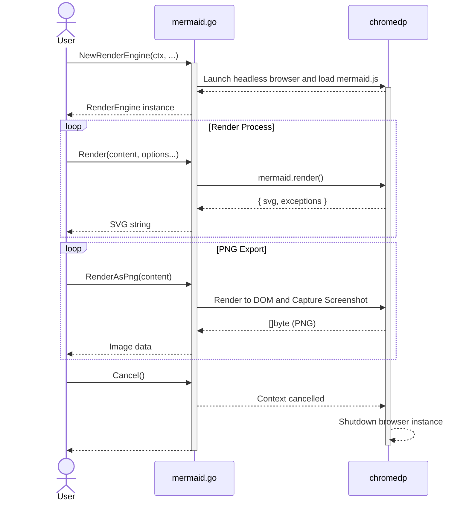

# mermaid.go

[mermaid.go][] is a lightweight Go library that bridges [mermaid.js](https://github.com/mermaid-js/mermaid) and Go, allowing you to generate high-quality diagrams (SVG and PNG) directly from your Go applications.

It works by leveraging [chromedp](https://github.com/chromedp/chromedp) to run a headless Chrome/Chromium instance, providing a robust and accurate rendering environment for all Mermaid diagram types.

## Prerequisites

Since this library uses `chromedp`, you must have **Google Chrome** or **Chromium** installed on your system.

## Installation

```shell
go get -u github.com/dreampuf/mermaid.go
```

## Architecture


```mermaid
sequenceDiagram
    Actor A as User
    participant B as mermaid.go
    participant C as chromedp

    A ->>+ B: NewRenderEngine(ctx, ...)
    B ->>+ C: Launch headless browser and load mermaid.js
    C -->> B: 
    B -->> A: RenderEngine instance
    
    loop Render Process
        A ->> B: Render(content, options...)
        B ->> C: mermaid.render()
        C -->> B: { svg, exceptions }
        B -->> A: SVG string
    end

    loop PNG Export
        A ->> B: RenderAsPng(content)
        B ->> C: Render to DOM and Capture Screenshot
        C -->> B: []byte (PNG)
        B -->> A: Image data
    end

    A ->> B: Cancel()
    B -->> C: Context cancelled
    C -->>- C: Shutdown browser instance
    B -->>- A: 
```

## API Overview

### `NewRenderEngine(ctx context.Context, statements []string, options ...chromedp.ExecAllocatorOption) (*RenderEngine, error)`
Initializes a new render engine by launching a headless browser and loading `mermaid.js`. 
- `statements`: Optional JavaScript statements to execute during initialization (e.g., custom mermaid configuration).
- `options`: Variadic list of `chromedp` allocator options.

### `Render(content string, opts ...RenderOption) (string, error)`
Renders a Mermaid diagram source into an SVG string.
- `WithBundle()`: An option to include the original Mermaid source code within a `<desc>` tag in the generated SVG.

### `RenderAsPng(content string) ([]byte, *BoxModel, error)`
Renders a Mermaid diagram source into a PNG image. Returns the raw PNG bytes and the diagram's bounding box dimensions.

### `RenderAsScaledPng(content string, scale float64) ([]byte, *BoxModel, error)`
Renders a Mermaid diagram into a scaled PNG image. Useful for generating high-resolution outputs.

### `Cancel()`
Closes the underlying browser instance and releases all associated resources.

## Example

```go
package main

import (
	"context"
	"os"

	"github.com/dreampuf/mermaid.go"
)

func main() {
	ctx := context.Background()
	// Initialize the engine
	re, err := mermaid_go.NewRenderEngine(ctx, nil)
	if err != nil {
		panic(err)
	}
	defer re.Cancel()

	content := "graph TD; A-->B;"

	// Render as SVG with the original source bundled
	svg, err := re.Render(content, mermaid_go.WithBundle())
	if err != nil {
		panic(err)
	}
	os.WriteFile("diagram.svg", []byte(svg), 0644)

	// Render as high-res PNG
	png, _, err := re.RenderAsScaledPng(content, 2.0)
	if err != nil {
		panic(err)
	}
	os.WriteFile("diagram.png", png, 0644)
}
```

## How to build locally

1. Checkout the code base:
   `git clone https://github.com/dreampuf/mermaid.go.git`
2. Fetch the latest version of `mermaid.js` (optional, as it's already embedded):
    `curl -LO https://unpkg.com/mermaid/dist/mermaid.min.js`
3. Run tests:
   `go test -v ./...`

## License

- [mermaid.go][]: MIT License
- [mermaid.js][]: MIT License
- [chromedp]: MIT License
 
[mermaid.go]: https://github.com/dreampuf/mermaid.go
[mermaid.js]: https://mermaid-js.github.io/mermaid/
[chromedp]: https://github.com/chromedp/chromedp

